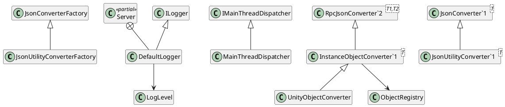
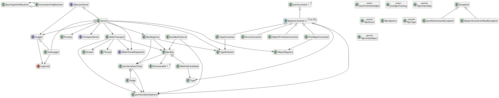

# Class Diagrams

## UniLiquidLink

### Classes

```plantuml
@startuml classes_UniLiquidLink
set namespaceSeparator none
hide members

class JsonUtilityConverterFactory {
    + <<override>> CanConvert(typeToConvert:Type) : bool
    + <<override>> CreateConverter(typeToConvert:Type, options:JsonSerializerOptions) : JsonConverter
}
class DefaultLogger {
    + DefaultLogger()
    + Info(msg:string) : void
    + Debug(msg:string) : void
    + InfoFormat(format:string, args:object[]) : void
    + DebugFormat(format:string, args:object[]) : void
}
class MainThreadDispatcher {
    + Enqueue(action:Action) : void
    + Start() : void
    + Stop() : void
    - ProcessAll() : void
}
class Server <<partial>> {
    - _pythonServerStartCommand : string
    # <<override>> CreateDefaultLogger() : ILogger
    {static} - Server()
    + Server(pythonServerStartCommand:string)
    + Server(pythonServerStartCommand:string, transport:ITransportServer, dispatcher:IMainThreadDispatcher)
    + Start() : void
    - {static} GetCurrentDirectory(path:string) : string
    - {static} GetRootLibDirectory(path:string) : string
    - {static} GetPythonDirectory(path:string) : string
    - StartPythonMiddleware(pythonServerStartCommand:string) : Process
    + RegisterObject(obj:UnityEngine.Object) : void
    + UnregisterObject(obj:UnityEngine.Object) : void
}
class Server <<partial>> {
    # <<override>> AddConverters() : void
}
class Server <<partial>> {
    # <<override>> AddFallbackConverters() : void
}
class UnityObjectConverter {
    + UnityObjectConverter(registry:ObjectRegistry)
}
class "InstanceObjectConverter`1"<T> {
    + InstanceObjectConverter(registry:ObjectRegistry)
    + <<override>> CanConvert(typeToConvert:Type) : bool
    + <<override>> Read(reader:Utf8JsonReader, typeToConvert:Type, options:JsonSerializerOptions) : T
    + <<override>> Write(writer:Utf8JsonWriter, value:T, options:JsonSerializerOptions) : void
}
class "InstanceObjectConverter`1"<T> {
}
class "JsonConverter`1"<T> {
}
class "JsonUtilityConverter`1"<T> {
    + <<override>> Read(reader:Utf8JsonReader, typeToConvert:Type, options:JsonSerializerOptions) : T
    + <<override>> Write(writer:Utf8JsonWriter, value:T, options:JsonSerializerOptions) : void
}
class "RpcJsonConverter`2"<T1,T2> {
}

"JsonConverter`1" <|-- "JsonUtilityConverter`1"
"RpcJsonConverter`2" <|-- "InstanceObjectConverter`1"
ILogger <|-- DefaultLogger
IMainThreadDispatcher <|-- MainThreadDispatcher
JsonConverterFactory <|-- JsonUtilityConverterFactory
"InstanceObjectConverter`1" <|-- UnityObjectConverter
Server +-- DefaultLogger
DefaultLogger --> LogLevel
"InstanceObjectConverter`1" --> ObjectRegistry
@enduml
```

## LLiquidLink

### Classes

```plantuml
@startuml classes_LLiquidLink
set namespaceSeparator none
hide members

class ConverterOnlyResolver {
    + GetTypeInfo(type:Type, options:JsonSerializerOptions) : JsonTypeInfo?
}
class EnumConverter {
    + <<override>> CanConvert(typeToConvert:Type) : bool
    + <<override>> Read(reader:Utf8JsonReader, typeToConvert:Type, options:JsonSerializerOptions) : System.Enum
    + <<override>> Write(writer:Utf8JsonWriter, value:System.Enum, options:JsonSerializerOptions) : void
}
interface IExecutorServer {
}
interface ILogger {
    Info(msg:string) : void
    Debug(msg:string) : void
    InfoFormat(format:string, args:object[]) : void
    DebugFormat(format:string, args:object[]) : void
}
interface IMainThreadDispatcher {
    Enqueue(action:Action) : void
    Start() : void
    Stop() : void
}
interface ITransportServer {
     <<event>> OnConnect : Action<int, string> 
     <<event>> OnDisconnect : Action<int> 
     <<event>> OnData : Action<int, ArraySegment<byte>> 
     <<event>> OnError : Action<int, Exception> 
    ClientId : int <<get>>
    Start() : void
    Stop() : void
    SendAll(data:ArraySegment<byte>) : void
}
class JsonElementLeakException {
    + JsonElementLeakException()
    + JsonElementLeakException(message:string)
    + JsonElementLeakException(message:string, innerException:Exception)
    # JsonElementLeakException(info:SerializationInfo, context:StreamingContext)
}
class JsonRpcProtocol {
    + JsonRpcProtocol(bus:RpcBus, send:Action<byte[]>, getLogger:Func<ILogger>, jsonOptions:JsonSerializerOptions, onError:Action<Exception>)
    + HandleMessage(raw:byte[]) : void
    - SendBytes(bytes:byte[]) : void
}
class JsonSerializerChain {
    + JsonSerializerChain(pre:JsonSerializerOptions, main:JsonSerializerOptions, fallback:JsonSerializerOptions)
    + Deserialize(rawJson:string, type:Type) : object
    + SerializeToElement(value:object, type:Type) : object
    - Run(op:Func<JsonSerializerOptions, object>) : object
}
enum LogLevel {
    Debug= 0,
    Info= 1,
    None= 2,
}
class MethodCandidate {
    + IsStatic : bool
    + FullName : string
}
class NullLogger {
    + Debug(msg:string) : void
    + Info(msg:string) : void
    + InfoFormat(format:string, args:object[]) : void
    + DebugFormat(format:string, args:object[]) : void
}
class ObjectPrimitiveConverter {
    + <<override>> CanConvert(typeToConvert:Type) : bool
    + <<override>> Read(reader:Utf8JsonReader, typeToConvert:Type, options:JsonSerializerOptions) : object
    + <<override>> Write(writer:Utf8JsonWriter, value:object, options:JsonSerializerOptions) : void
}
class ObjectRegistry {
    +  <<event>> OnRemoveObject : Action<int> 
    + ObjectRegistry(getLogger:Func<ILogger>)
    + GetObject(instanceId:long) : object
    + RegisterObject(obj:object) : long
    + UnregisterObject(obj:object) : void
    + ClearObjectMap() : void
    + RemoveObject(instanceId:int) : void
}
class PreObjectConverter {
    + PreObjectConverter(registry:ObjectRegistry)
    + <<override>> CanConvert(typeToConvert:Type) : bool
    + <<override>> Read(reader:Utf8JsonReader, typeToConvert:Type, options:JsonSerializerOptions) : object
    + <<override>> Write(writer:Utf8JsonWriter, value:object, options:JsonSerializerOptions) : void
}
class RpcBus {
    + RpcBus(getLogger:Func<ILogger>, chain:JsonSerializerChain)
    + Register(rpcName:string, method:Delegate) : void
    + RegisterDirect(rpcName:string, instanceType:Type, methodName:string, methodParams:ParameterInfo[], body:Func<object[], object>, logName:string) : void
    + RegisterMethodOverloads(rpcName:string, candidates:IList<MethodCandidate>) : void
    + RegisterDirectMethodOverloads(rpcName:string, methodName:string, candidates:IList<MethodCandidate>) : void
    - BuildCandidateArgs(c:MethodCandidate, args:JsonElement[]) : object[]
    - DispatchCandidates(rpcName:string, candidates:IList<MethodCandidate>, args:JsonElement[]) : object
    + DispatchDirectWithObj(orgObj:object, methodName:string, restArgs:JsonElement[]) : object
    + Dispatch(method:string, args:JsonElement[]) : object
    - BuildInstanceCallArgs(instance:object, restArgs:JsonElement[], paramInfos:ParameterInfo[]) : object[]
    - DeserializeArg(arg:JsonElement, orgType:Type) : object
    - DeserializeArgs(args:JsonElement[], paramInfos:ParameterInfo[]) : object[]
    - Invoke(method:Delegate, args:object[]) : object
    - WrapResult(result:object) : object
    {static} - TryGetDefaultValue(param:ParameterInfo, value:object) : bool
    {static} - ResolveDefaultValue(attrValue:object, targetType:Type) : object
}
class RpcJsonConverterReadException {
    + RpcJsonConverterReadException()
    + RpcJsonConverterReadException(message:string)
    + RpcJsonConverterReadException(message:string, innerException:Exception)
    # RpcJsonConverterReadException(info:SerializationInfo, context:StreamingContext)
}
class RpcRegistrar {
    + RpcRegistrar(bus:RpcBus, chain:JsonSerializerChain, getLogger:Func<ILogger>, typeResolver:TypeResolver)
    + AddRpcConverter(converter:RpcJsonConverter<TOrg, TRpc>) : void
    + AddFallbackConverterFactory(factory:JsonConverterFactory) : void
    + AddPreConverter(converter:RpcJsonConverter<TOrg, TRpc>) : void
    + AddRpcMethod(handler:TDelegate, options:RpcOptions) : void
    + AddRpcGetProperty(expr:Expression<Func<TObj, TResult>>) : void
    + AddRpcRootGetProperty(name:string, getter:Func<TResult>) : void
    + AddRpcSetProperty(expr:Expression<Func<TObj, TResult>>) : void
    + AddRpcDirectMethod(handler:Expression<TDelegate>) : void
    + AddRpcAllMethod(type:Type, options:RpcOptions) : void
    + AddRpcAllDirectMethod(type:Type, options:RpcOptions) : void
    + AddRpcAllGetProperty(type:Type, options:RpcOptions) : void
    + AddRpcAllSetProperty(type:Type, options:RpcOptions) : void
    {static} - MemberFlags(includeInherited:bool) : BindingFlags
    {static} - EnumerateSelfAndNestedTypes(type:Type, includeNested:bool) : IEnumerable<Type>
    {static} - EnumerateMethods(type:Type, includeInherited:bool) : IEnumerable<IGrouping<string, MethodInfo>>
    {static} - HasUnsupportedParameters(m:MethodBase) : bool
    {static} - MakeCandidate(type:Type, m:MethodInfo) : RpcBus.MethodCandidate
    + JsonRpc_ResolveChain(obj:JsonElement, steps:RpcChainStep[], method:string, args:JsonElement) : object
    + JsonRpc_ResolveChainSet(obj:JsonElement, steps:RpcChainStep[], property:string, value:JsonElement) : object
    - DeserializeRoot(obj:JsonElement) : object
    - DeserializeWithFallback(rawJson:string, targetType:Type) : object
    + SaveRpcNamesCsv(path:string) : void
    - ResolveStep(current:object, name:string, stepArgs:JsonElement[]) : object
}
class Server {
    + WorkingDirectory : string <<get>> <<set>>
    +  <<event>> OnDisconnect : Action<int> 
    +  <<event>> OnServerError : Action<string> 
    # RaiseOnDisconnect(clientId:int) : void
    # <<virtual>> CreateDefaultLogger() : ILogger
    # <<virtual>> AddConverters() : void
    # <<virtual>> AddFallbackConverters() : void
    # Server(dispatcher:IMainThreadDispatcher)
    # Server(transport:ITransportServer, dispatcher:IMainThreadDispatcher)
    # BuildCoreStack(jsonOptions:JsonSerializerOptions) : RpcBus
    + Stop() : void
    + IsRunning : bool <<get>> <<protected set>>
    + SendEvent(eventType:string, data:Dictionary<string, object>) : void
    + RegisterCallerAssembly() : void
}
class StdioTransport {
    <<readonly>> - _sendLock : object
    - _running : bool
    <<const>> - ClientId : int = 1
    +  <<event>> OnConnect : Action<int> 
    +  <<event>> OnDisconnect : Action<int> 
    + StdioTransport(dispatcher:IMainThreadDispatcher, bus:RpcBus, jsonOptions:JsonSerializerOptions, getLogger:Func<ILogger>, onError:Action<Exception>)
    + Start(inStream:Stream, outStream:Stream) : void
    + Stop() : void
    - Send(frame:byte[]) : void
    - ReadLoop() : void
    - ReadFully(buffer:byte[]) : bool
    - Dispatch(rawJson:byte[]) : void
}
class TypeConverter {
    + TypeConverter(resolver:TypeResolver)
    + <<override>> Read(reader:Utf8JsonReader, typeToConvert:Type, options:JsonSerializerOptions) : Type
    + <<override>> Write(writer:Utf8JsonWriter, value:Type, options:JsonSerializerOptions) : void
}
class TypeResolver {
    + TypeResolver(getLogger:Func<ILogger>)
    + RegisterCallerAssembly() : void
    + RegisterAssembly(asm:Assembly) : void
    - AddAssembly(asm:Assembly) : void
    + SaveAllowedTypesCsv(path:string) : void
    + Resolve(typeName:string) : Type
}
class "IEnumerable`1"<T> {
}
class "JsonConverter`1"<T> {
}
class "RpcJsonConverter`2"<T1,T2> {
}
class "RpcJsonConverter`2"<T1,T2> {
}
class "RpcJsonConverter`2"<T1,T2> {
}
class "RpcJsonConverter`2"<T1,T2> {
}
abstract class "RpcJsonConverter`2"<TOrg,TRpc> {
    + rpcTypeName : string <<get>>
}
class JsonPrimitiveHelper <<static>> {
    + {static} IsPrimitive(value:object) : bool
    + {static} ReadRaw(reader:Utf8JsonReader) : object
    + {static} WriteRaw(writer:Utf8JsonWriter, value:object) : void
}
class JsonRpcFraming <<static>> {
    <<internal>> {static} WrapFrame(body:byte[]) : byte[]
    <<internal>> {static} ReadFrameLength(stream:Stream) : int
    <<internal>> {static} BuildResponse(idJson:string, result:object, error:string, opts:JsonSerializerOptions) : byte[]
}
class RpcChainStep <<partial>> {
    + name : string <<get>> <<set>>
}
class RpcEnum <<partial>> {
    + rpcEnum : long? <<get>> <<set>>
    + value : string <<get>> <<set>>
}
class RpcOptions {
    + IncludeInherited : bool <<get>> <<set>>
    + IncludeNested : bool <<get>> <<set>>
}
class RpcType <<partial>> {
    + rpcType : long? <<get>> <<set>>
    + value : string <<get>> <<set>>
}
class RpcUnityObject <<partial>> {
    + instanceId : long <<get>> <<set>>
    + instanceObjectAttr : long? <<get>> <<set>>
    + name : string <<get>> <<set>>
    + orgType : string <<get>> <<set>>
    + rpcType : string <<get>> <<set>>
}

"JsonConverter`1" <|-- "RpcJsonConverter`2"
"RpcJsonConverter`2" <|-- EnumConverter
"RpcJsonConverter`2" <|-- ObjectPrimitiveConverter
"RpcJsonConverter`2" <|-- PreObjectConverter
"RpcJsonConverter`2" <|-- TypeConverter
Exception <|-- JsonElementLeakException
Exception <|-- RpcJsonConverterReadException
IExecutorServer <|-- Server
IJsonTypeInfoResolver <|-- ConverterOnlyResolver
ILogger <|-- NullLogger
JsonSerializerChain +-- Stage
RpcBus +-- MethodCandidate
Server +-- NullLogger
"RpcJsonConverter`2" o-> JsonSerializerOptions
ConverterOnlyResolver o-> IJsonTypeInfoResolver
"RpcJsonConverter`2" --> Type
IExecutorServer --> ILogger
ILogger --> LogLevel
JsonRpcProtocol --> JsonSerializerOptions
JsonRpcProtocol --> RpcBus
JsonSerializerChain --> JsonSerializerOptions
MethodCandidate --> Type
NullLogger --> LogLevel
PreObjectConverter --> ObjectRegistry
RpcBus --> "IEnumerable`1"
RpcBus --> JsonSerializerChain
RpcRegistrar --> JsonSerializerChain
RpcRegistrar --> RpcBus
RpcRegistrar --> TypeResolver
Server --> ILogger
Server --> IMainThreadDispatcher
Server --> ITransportServer
Server --> ObjectRegistry
Server --> Process
Server --> RpcRegistrar
Server --> StdioTransport
Server --> TypeResolver
Stage --> JsonSerializerOptions
StdioTransport --> IMainThreadDispatcher
StdioTransport --> JsonSerializerOptions
StdioTransport --> RpcBus
StdioTransport --> Stream
StdioTransport --> Thread
TypeConverter --> TypeResolver
@enduml
```
