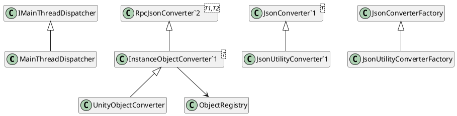

# Class Diagrams

## Python~\lliquidlink

### Classes

```plantuml
@startuml classes_Python~_lliquidlink
set namespaceSeparator none
hide members

class "Client" as lliquidlink.client._client.Client {
}
class "Event" as lliquidlink.client._event.Event {
}
class "SupportsAsDict" as lliquidlink.client._interfaces.SupportsAsDict {
}
class "ReleaseManager" as lliquidlink.client._release.ReleaseManager {
}
class "Transport" as lliquidlink.client._interfaces.Transport {
}
class "ObjectProxy" as lliquidlink.client._proxy.ObjectProxy {
}
class "PropertyProxy" as lliquidlink.client._proxy.PropertyProxy {
}
class "Serialization" as lliquidlink.client._serialization.Serialization {
}
class "StreamTransport" as lliquidlink.client._transports.StreamTransport {
}
class "_Slot" as lliquidlink.core._rpc._Slot {
}
class "MessageStream" as lliquidlink.server._interfaces.MessageStream {
}
class "RpcBridge" as lliquidlink.server._interfaces.RpcBridge {
}
class "_TcpConnection" as lliquidlink.server._transport._TcpConnection {
}
class "IpcBridge" as lliquidlink.server.ipc_bridge.IpcBridge {
}
class "JsonRpcPeer" as lliquidlink.core._rpc.JsonRpcPeer {
}
class "ByteStream" as lliquidlink.core._interfaces.ByteStream {
}
class "StdioByteStream" as lliquidlink.core._rpc.StdioByteStream {
}
class "RpcNameResolver" as lliquidlink.server.resolver.RpcNameResolver {
}
class "TypeNameResolver" as lliquidlink.server.resolver.TypeNameResolver {
}
class "Server" as lliquidlink.server.server.Server {
}
class "ServerTransport" as lliquidlink.server._transport.ServerTransport {
}
class "TcpServerTransport" as lliquidlink.server._transport.TcpServerTransport {
}
class "RpcChainStep" as lliquidlink.client._schema.RpcChainStep {
}
class "RpcEnum" as lliquidlink.client._schema.RpcEnum {
}
class "RpcResolveChainParam" as lliquidlink.client._schema.RpcResolveChainParam {
}
class "RpcResolveChainSetParam" as lliquidlink.client._schema.RpcResolveChainSetParam {
}
class "RpcType" as lliquidlink.client._schema.RpcType {
}
class "<color:red>ConnectionClosedError</color>" as lliquidlink.core._rpc.ConnectionClosedError {
}
class "<color:red>RpcError</color>" as lliquidlink.core._rpc.RpcError {
}

lliquidlink.client._proxy.ObjectProxy --|> lliquidlink.client._interfaces.SupportsAsDict
lliquidlink.client._transports.StreamTransport --|> lliquidlink.client._interfaces.Transport
lliquidlink.server._transport._TcpConnection --|> lliquidlink.server._interfaces.MessageStream
lliquidlink.server.ipc_bridge.IpcBridge --|> lliquidlink.server._interfaces.RpcBridge
lliquidlink.core._rpc.StdioByteStream --|> lliquidlink.core._interfaces.ByteStream
lliquidlink.server._transport.TcpServerTransport --|> lliquidlink.server._transport.ServerTransport
lliquidlink.client._client.Client *-- lliquidlink.client._event.Event : on_execute
lliquidlink.client._client.Client *-- lliquidlink.client._release.ReleaseManager : _release
lliquidlink.client._client.Client *-- lliquidlink.client._serialization.Serialization : _serialization
lliquidlink.client._transports.StreamTransport *-- lliquidlink.core._rpc.JsonRpcPeer : _peer
lliquidlink.server.ipc_bridge.IpcBridge *-- lliquidlink.core._rpc.JsonRpcPeer : _peer
lliquidlink.client._client.Client o-- lliquidlink.client._interfaces.Transport : _transport
lliquidlink.client._release.ReleaseManager o-- lliquidlink.client._interfaces.Transport : _transport
lliquidlink.core._rpc.JsonRpcPeer o-- lliquidlink.core._interfaces.ByteStream : _stream
lliquidlink.server.server.Server o-- lliquidlink.server._transport.ServerTransport : _transport
lliquidlink.client._proxy.ObjectProxy --> lliquidlink.client._interfaces.Transport : _transport
lliquidlink.client._proxy.PropertyProxy --> lliquidlink.client._interfaces.Transport : _transport
lliquidlink.core._rpc.JsonRpcPeer --> lliquidlink.core._rpc._Slot : _pending
lliquidlink.server.server.Server --> lliquidlink.server.ipc_bridge.IpcBridge : _bridge
lliquidlink.server.server.Server --> lliquidlink.server.resolver.RpcNameResolver : _resolver
lliquidlink.server.server.Server --> lliquidlink.server.resolver.TypeNameResolver : _type_resolver
@enduml
```

### Packages

```plantuml
@startuml packages_Python~_lliquidlink
set namespaceSeparator none
hide members
package "lliquidlink" as lliquidlink {
}
package "lliquidlink.client" as lliquidlink.client {
}
package "lliquidlink.client._client" as lliquidlink.client._client {
}
package "lliquidlink.client._event" as lliquidlink.client._event {
}
package "lliquidlink.client._interfaces" as lliquidlink.client._interfaces {
}
package "lliquidlink.client._proxy" as lliquidlink.client._proxy {
}
package "lliquidlink.client._release" as lliquidlink.client._release {
}
package "lliquidlink.client._schema" as lliquidlink.client._schema {
}
package "lliquidlink.client._serialization" as lliquidlink.client._serialization {
}
package "lliquidlink.client._transports" as lliquidlink.client._transports {
}
package "lliquidlink.client.models" as lliquidlink.client.models {
}
package "lliquidlink.core" as lliquidlink.core {
}
package "lliquidlink.core._interfaces" as lliquidlink.core._interfaces {
}
package "lliquidlink.core._rpc" as lliquidlink.core._rpc {
}
package "lliquidlink.server" as lliquidlink.server {
}
package "lliquidlink.server.__main__" as lliquidlink.server.__main__ {
}
package "lliquidlink.server._interfaces" as lliquidlink.server._interfaces {
}
package "lliquidlink.server._transport" as lliquidlink.server._transport {
}
package "lliquidlink.server.ipc_bridge" as lliquidlink.server.ipc_bridge {
}
package "lliquidlink.server.resolver" as lliquidlink.server.resolver {
}
package "lliquidlink.server.server" as lliquidlink.server.server {
}
lliquidlink.client --> lliquidlink.client._client
lliquidlink.client --> lliquidlink.client._event
lliquidlink.client --> lliquidlink.client._interfaces
lliquidlink.client --> lliquidlink.client._proxy
lliquidlink.client --> lliquidlink.client._release
lliquidlink.client --> lliquidlink.client._transports
lliquidlink.client --> lliquidlink.core
lliquidlink.client._client --> lliquidlink.client._event
lliquidlink.client._client --> lliquidlink.client._proxy
lliquidlink.client._client --> lliquidlink.client._release
lliquidlink.client._client --> lliquidlink.client._serialization
lliquidlink.client._proxy --> lliquidlink.client._interfaces
lliquidlink.client._proxy --> lliquidlink.client.models
lliquidlink.client._transports --> lliquidlink.client._interfaces
lliquidlink.client.models --> lliquidlink.client._schema
lliquidlink.core --> lliquidlink.core._interfaces
lliquidlink.core --> lliquidlink.core._rpc
lliquidlink.core._rpc --> lliquidlink.core._interfaces
lliquidlink.server --> lliquidlink.server.server
lliquidlink.server.__main__ --> lliquidlink.server.server
lliquidlink.server._transport --> lliquidlink.server._interfaces
lliquidlink.server.ipc_bridge --> lliquidlink.server._interfaces
lliquidlink.server.server --> lliquidlink.server._interfaces
lliquidlink.server.server --> lliquidlink.server._transport
lliquidlink.server.server --> lliquidlink.server.ipc_bridge
lliquidlink.server.server --> lliquidlink.server.resolver
lliquidlink.client._client ..> lliquidlink.client._interfaces
lliquidlink.client._interfaces ..> lliquidlink.client._serialization
lliquidlink.client._release ..> lliquidlink.client._interfaces
lliquidlink.client._transports ..> lliquidlink.client._serialization
@enduml
```

## UniLiquidLink

### Classes

```plantuml
@startuml classes_UniLiquidLink
set namespaceSeparator none
hide members

class MainThreadDispatcher {
    + Enqueue(action:Action) : void
    + Start() : void
    + Stop() : void
    - ProcessAll() : void
}
class UnityObjectConverter {
    + UnityObjectConverter(registry:ObjectRegistry)
}
class "InstanceObjectConverter`1"<T> {
}
class "JsonConverter`1"<T> {
}
class "RpcJsonConverter`2"<T1,T2> {
}

"JsonConverter`1" <|-- "JsonUtilityConverter`1"
"RpcJsonConverter`2" <|-- "InstanceObjectConverter`1"
IMainThreadDispatcher <|-- MainThreadDispatcher
JsonConverterFactory <|-- JsonUtilityConverterFactory
"InstanceObjectConverter`1" <|-- UnityObjectConverter
"InstanceObjectConverter`1" --> ObjectRegistry
@enduml
```

## LLiquidLink

### Classes

```plantuml
@startuml classes_LLiquidLink
set namespaceSeparator none
hide members

interface IExecutorServer {
}
interface IMainThreadDispatcher {
    Enqueue(action:Action) : void
    Start() : void
    Stop() : void
}
interface ITransportServer {
     <<event>> OnConnect : Action<int, string> 
     <<event>> OnDisconnect : Action<int> 
     <<event>> OnData : Action<int, ArraySegment<byte>> 
     <<event>> OnError : Action<int, Exception> 
    ClientId : int <<get>>
    Start() : void
    Stop() : void
    SendAll(data:ArraySegment<byte>) : void
}
class JsonElementLeakException {
    + JsonElementLeakException()
    + JsonElementLeakException(message:string)
    + JsonElementLeakException(message:string, innerException:Exception)
    # JsonElementLeakException(info:SerializationInfo, context:StreamingContext)
}
class MethodCandidate {
    + IsStatic : bool
    + FullName : string
}
class RpcJsonConverterReadException {
    + RpcJsonConverterReadException()
    + RpcJsonConverterReadException(message:string)
    + RpcJsonConverterReadException(message:string, innerException:Exception)
    # RpcJsonConverterReadException(info:SerializationInfo, context:StreamingContext)
}
class RpcRegistrationTable {
}
enum Stage {
    Pre= 0,
    Main= 1,
    Fallback= 2,
}
class "JsonConverter`1"<T> {
}
class "RpcJsonConverter`2"<T1,T2> {
}
class "RpcJsonConverter`2"<T1,T2> {
}
class "RpcJsonConverter`2"<T1,T2> {
}
class "RpcJsonConverter`2"<T1,T2> {
}
class JsonPrimitiveHelper <<static>> {
    + {static} ReadRaw(reader:Utf8JsonReader) : object
    + {static} WriteRaw(writer:Utf8JsonWriter, value:object) : void
}
class JsonRpcFraming <<static>> {
    + {static} WrapFrame(body:byte[]) : byte[]
    + {static} ReadFrameLength(stream:Stream) : int
    + {static} BuildResponse(id:long, result:object, error:string, opts:JsonSerializerOptions) : byte[]
}
class RpcChainStep <<partial>> {
    + name : string <<get>> <<set>>
}
class RpcEnum <<partial>> {
    + rpcEnum : long? <<get>> <<set>>
    + value : string <<get>> <<set>>
}
class RpcOptions {
    + IncludeInherited : bool <<get>> <<set>>
    + IncludeNested : bool <<get>> <<set>>
}
class RpcRequest <<partial>> {
    + id : long? <<get>> <<set>>
    + method : string <<get>> <<set>>
}
class RpcResolveChainParam <<partial>> {
    + method : string <<get>> <<set>>
}
class RpcResolveChainSetParam <<partial>> {
    + property : string <<get>> <<set>>
}
class Utils <<static>> {
    + {static} GetCurrentDirectory(path:string) : string
}

"JsonConverter`1" <|-- "RpcJsonConverter`2"
"RpcJsonConverter`2" <|-- EnumConverter
"RpcJsonConverter`2" <|-- ObjectPrimitiveConverter
"RpcJsonConverter`2" <|-- PreObjectConverter
Exception <|-- JsonElementLeakException
Exception <|-- RpcJsonConverterReadException
IExecutorServer <|-- Server
ITransportServer <|-- StdioTransport
JsonSerializerChain +-- ConverterOnlyResolver
JsonSerializerChain +-- Stage
JsonSerializerChain +-- StageConfig
RpcSearcher +-- MethodCandidate
"RpcJsonConverter`2" o-> JsonSerializerOptions
RpcRegistry o-> RpcRegistrationTable
MethodCaller --> JsonSerializerChain
MethodCaller --> RpcSearcher
PreObjectConverter --> ObjectRegistry
PythonProcessManager --> Process
PythonProcessManager --> ProcessStartInfo
RpcRegistry --> RpcSearcher
RpcSearcher --> RpcRegistrationTable
Server --> IMainThreadDispatcher
Server --> ITransportServer
Server --> JsonSerializerChain
Server --> ObjectRegistry
Server --> PythonProcessManager
Server --> RpcRegistry
StageConfig --> JsonSerializerOptions
StdioTransport --> IMainThreadDispatcher
StdioTransport --> JsonSerializerOptions
StdioTransport --> MethodCaller
StdioTransport --> Stream
StdioTransport --> Thread
@enduml
```
