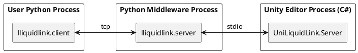

# LLiquidLink / UniLiquidLink
```python
cube = client.GameObject.CreatePrimitive(enum("Cube"))
cube.transform.Rotate(30, 45, 0)
```

Unity Editor の 機能を、外部の Python プロセスから JSON-RPC 経由で操作するためのブリッジライブラリです。
Python 側からほぼ Unity C# と同じ構文で呼び出せます。

## 特徴

- **Unity C# とほぼ同じ構文で書ける**
  - C# : `cube.transform.Rotate(30, 45, 0)` Python : `cube.transform.Rotate(30, 45, 0)` 
  - プロパティチェーン・メソッド呼び出しをそのまま 変換
- **Python からノーコンパイル・型なしで実行できる**
  - C#で必要だったコンパイルや型宣言がPythonでは不要です
- **Unity と Python は完全に独立**
  Unity（C#）と Python は JSON-RPC でのみやり取りする別プロセスです。互いに直接のバインディングや DLL 依存を持たないため、ユーザーの好きな Unity バージョン・Python バージョンの組み合わせで動作します。
- **C# 側で登録済みの機能のみ実行可能**
  Python から呼べるのは、C# 側で 明示的に登録したメソッド・プロパティだけです。未登録の API は一切呼び出せません（ホワイトリスト方式）
- **anyio 採用で広いトランスポート層に対応**
  コア通信層（`lliquidlink.core` / `lliquidlink.client`）は [anyio](https://anyio.readthedocs.io/) 上に実装されています。現状は TCP と stdio のみですが、anyio を使った拡張が可能な設計になっています。

## アーキテクチャ

Python の「ユーザークライアント」「ミドルウェア」と Unity の「C# サーバー」の3プロセス構成です。



## インストール方法

現時点では Unity Package Manager (UPM) の `package.json` も、Python の pip パッケージも配布していません。以下の手順で手動セットアップしてください。

### Unity（C#）側

1. フォルダをそのままプロジェクトの `Assets/Editor/` 配下にコピーします（`UnityExecutor.asmdef` により Editor 専用アセンブリとして扱われます）。
2. `UnityExecutor.asmdef` は以下の precompiled DLL を参照します。プロジェクトにこれらが存在しないとコンパイルエラーになります。
   - `System.Text.Json.dll`

   入手方法の例:
   - NuGet パッケージ（`System.Text.Json`）を [NuGetForUnity](https://github.com/GlitchEnzo/NuGetForUnity) 等で取得し、DLL を `Assets/Plugins` などに配置する
   - いずれも Editor 専用で問題ないため、Plugins の Inspector で対象プラットフォームを Editor のみに設定することを推奨します

### Python 側

1. pip パッケージとして配布していないため、`Python/` ディレクトリを `PYTHONPATH` に追加して利用します。

2. 実行に必須のライブラリをインストールします。

   ```bash
   pip install anyio
   ```

3. テストを実行する場合のみ、追加で以下が必要です（開発用途）。

   ```bash
   pip install pytest pytest-asyncio
   ```

## 実行方法

`Samples/CubeDemo` の最小サンプルで動作確認できます。

1. Unity メニューから `UniLiquidLink/Samples/Cube Demo Server Start` を実行し、C# 側のサーバーを起動します（既定で `http://localhost:8700` で待ち受けます）。

   ```csharp
   // Samples/CubeDemo/CubeDemoServer.cs (抜粋)
   server = new Server();
   server.RegisterCallerAssembly();

   // Create a primitive: client.GameObject.CreatePrimitive(enum("Cube"))
   server.Rpc.AddRpcMethod((Func<PrimitiveType, GameObject>)GameObject.CreatePrimitive);

   // Property chain: cube.transform.Rotate(...) or cube.transform.position = ...
   server.Rpc.AddRpcGetProperty((GameObject obj) => obj.transform);
   ```

2. Python 側のサンプルスクリプトを実行します。

   ```bash
   python Samples/CubeDemo/create_and_rotate_cube.py
   ```

   ```python
   # Samples/CubeDemo/create_and_rotate_cube.py (抜粋)
   from lliquidlink.client import Client, TcpJsonRpcTransport
   from lliquidlink.client.models import type_, enum

    def on_execute(client):
        cube = client.GameObject.CreatePrimitive(enum("Cube"))
        renderer = cube.GetComponent(type_("Renderer"))
        renderer.material.color = {"r": 1, "g": 0, "b": 0, "a": 1}
        cube.transform.Rotate(30, 45, 0)

    client = Client(TcpJsonRpcTransport("localhost", 8700))
    client.on_execute += on_execute
    client.mainloop()
   ```

   実行すると、Unity シーン内に赤い Cube が生成され、回転します。

## 対応機能

- **RPC メソッド登録（C# 側）**
  - 静的メソッド／インスタンスメソッドを個別・一括登録
  - プロパティ取得・設定の個別・一括登録
- **インスタンスオブジェクトの受け渡し**
  Unity 側のGameObjectなどのインスタンスオブジェクトをPython 側で受け渡しできます
- **型・Enum 解決**
  `type_("Renderer")` や `enum("Cube")` のようなUnity型を名前解決します
- **シリアライズ**
  `System.Text.Json` をメインに、`Vector3` 等 Unity 固有の値型は `JsonUtility` ベースのシリアライズで変換する構成です
- **メソッドオーバーロード対応**
  - 登録メソッドにオーバーロードがある場合は順番に解決し、成功したものを採用します

## セキュリティに関する注意

- 本ライブラリには認証・認可の仕組みが一切実装されていません。httpサーバー（既定で `localhost:8700`）は接続してきたクライアントを無条件に受け入れます。
- 実質的な防御境界は「既定で `localhost` にのみバインドされる」ことだけです。LAN やインターネットに公開する構成にする場合は、リバースプロキシや VPN、あるいはトランスポート層のサブクラス化によるトークン認証・TLS 終端などを追加してください。
- C# 側で明示登録した RPC のみ実行可能というホワイトリスト方式が唯一の実行制御ですが、`AddRpcAllMethod` でクラス全体を一括登録した場合は、想定より広い API 表面が外部から呼び出し可能になる点に注意してください。
- Unity Editor プロセスと同じ権限で任意の登録済み C# コードが実行されるため、信頼できないネットワーク上でこのサーバーを起動しないでください。

## 検証済みツールバージョン

以下は開発・動作確認済みの組み合わせです（厳密な必須バージョンではありません）。

| ツール / ライブラリ | バージョン |
| --- | --- |
| Unity Editor | 2022.3.22f1 (Editor 専用) |
| Python | 3.13.11 |
| anyio | 4.14.1 |
| pytest（テスト用） | 9.0.3 |
| pytest-asyncio（テスト用） | 1.3.0 |
