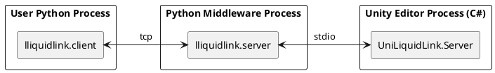

[日本語](README.ja.md)

**python**

```python
cube = client.GameObject.CreatePrimitive(enum("Cube"))
cube.transform.Rotate(30, 45, 0)
```

**To Unity**


# LLiquidLink / UniLiquidLink

A bridge library for operating Unity Editor features from an external Python process via JSON-RPC.
It lets you call Unity from Python using almost the same syntax as Unity C#.

## Features

- **Write with almost the same syntax as Unity C#**
  - C#: `cube.transform.Rotate(30, 45, 0)` Python: `cube.transform.Rotate(30, 45, 0)`
  - Property chains and method calls are converted as-is
- **Runs from Python with no compilation and no types**
  - The compilation and type declarations required in C# are not needed in Python
- **Unity and Python are completely independent**
  Unity (C#) and Python are separate processes that communicate only via JSON-RPC. Since they have no direct bindings or DLL dependencies on each other, they work with any combination of Unity version and Python version the user chooses.
- **Only functionality registered on the C# side can be executed**
  From Python you can only call methods/properties that were explicitly registered on the C# side. Unregistered APIs cannot be called at all (whitelist approach)
- **Built on anyio, supporting a wide range of transport layers**
  The core communication layer (`lliquidlink.core` / `lliquidlink.client`) is implemented on top of [anyio](https://anyio.readthedocs.io/). Currently only TCP and stdio are supported, but the design allows extension via anyio.

## Architecture

A 3-process configuration consisting of the Python "user client", the "middleware", and the Unity "C# server".



## Installation

At this time, neither a Unity Package Manager (UPM) `package.json` nor a Python pip package is distributed. Please set things up manually using the steps below.

### Unity (C#) side

1. Copy the folder as-is into your project's `Assets/Editor/` directory (it is treated as an Editor-only assembly via `UnityExecutor.asmdef`).
2. `UnityExecutor.asmdef` references the following precompiled DLL. If this is not present in your project, you will get a compile error.
   - `System.Text.Json.dll`

   Example ways to obtain it:
   - Get the NuGet package (`System.Text.Json`) via [NuGetForUnity](https://github.com/GlitchEnzo/NuGetForUnity) or similar, and place the DLL under `Assets/Plugins` etc.
   - Since these are only needed in the Editor, it is recommended to set the target platform to Editor only in the Plugins Inspector

### Python side

1. Since it is not distributed as a pip package, add the `Python/` directory to `PYTHONPATH` to use it.

2. Install the library required for execution.

   ```bash
   pip install anyio
   ```

3. Only if you want to run the tests, the following are additionally required (for development purposes).

   ```bash
   pip install pytest pytest-asyncio
   ```

## How to run

You can verify it works using the minimal sample in `Samples/CubeDemo`.

1. From the Unity menu, run `UniLiquidLink/Samples/Cube Demo Server Start` to start the C# server (by default it listens on `http://localhost:8700`).

   ```csharp
   // Samples/CubeDemo/CubeDemoServer.cs (excerpt)
   server = new Server();
   server.RegisterCallerAssembly();

   // Create a primitive: client.GameObject.CreatePrimitive(enum("Cube"))
   server.Rpc.AddRpcMethod((Func<PrimitiveType, GameObject>)GameObject.CreatePrimitive);

   // Property chain: cube.transform.Rotate(...) or cube.transform.position = ...
   server.Rpc.AddRpcGetProperty((GameObject obj) => obj.transform);
   ```

2. Run the sample script on the Python side.

   ```bash
   python Samples/CubeDemo/create_and_rotate_cube.py
   ```

   ```python
   # Samples/CubeDemo/create_and_rotate_cube.py (excerpt)
   from lliquidlink.client import Client, TcpJsonRpcTransport
   from lliquidlink.client.models import type_, enum

   class CubeDemoClient(Client):
       def __init__(self):
           super().__init__(TcpJsonRpcTransport("http://localhost", 8700))
           self.on_execute += self._on_execute

       def _on_execute(self, client):
           cube = client.GameObject.CreatePrimitive(enum("Cube"))
           renderer = cube.GetComponent(type_("Renderer"))
           renderer.material.color = {"r": 1, "g": 0, "b": 0, "a": 1}
           cube.transform.Rotate(30, 45, 0)

   client = CubeDemoClient()
   client.mainloop()
   ```

   When run, a red Cube is created in the Unity scene and rotates.

## Supported features

- **RPC method registration (C# side)**
  - Register static/instance methods individually or in bulk
  - Register property getters/setters individually or in bulk
- **Passing instance objects**
  Instance objects such as Unity's GameObject can be passed back and forth on the Python side
- **Type/Enum resolution**
  Resolves Unity types by name, such as `type_("Renderer")` or `enum("Cube")`
- **Serialization**
  Mainly uses `System.Text.Json`, while Unity-specific value types such as `Vector3` are converted using `JsonUtility`-based serialization
- **Method overload support**
  - If a registered method has overloads, they are resolved in order and the one that succeeds is used

## Security notes

- This library implements no authentication or authorization mechanism whatsoever. The HTTP server (by default `localhost:8700`) unconditionally accepts any client that connects.
- The only real protective boundary is that it binds to `localhost` only by default. If you configure it to be exposed to a LAN or the internet, add a reverse proxy, VPN, or token authentication/TLS termination via a transport-layer subclass, etc.
- The whitelist approach — where only RPCs explicitly registered on the C# side can be executed — is the only execution control in place, but note that if you bulk-register an entire class with `AddRpcAllMethod`, a wider API surface than intended may become externally callable.
- Arbitrary registered C# code executes with the same privileges as the Unity Editor process, so do not start this server on an untrusted network.

## Verified tool versions

The following are combinations that have been developed and verified to work (not strict required versions).

| Tool / Library | Version |
| --- | --- |
| Unity Editor | 2022.3.22f1 (Editor only) |
| Python | 3.13.11 |
| anyio | 4.14.1 |
| pytest (for testing) | 9.0.3 |
| pytest-asyncio (for testing) | 1.3.0 |
